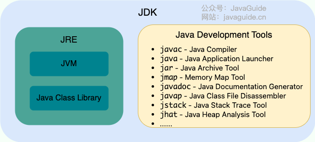
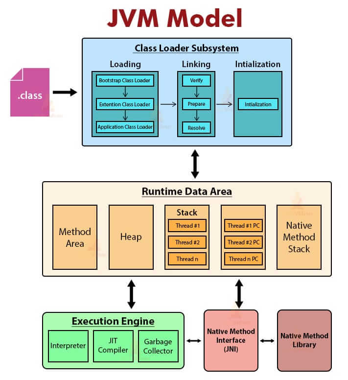
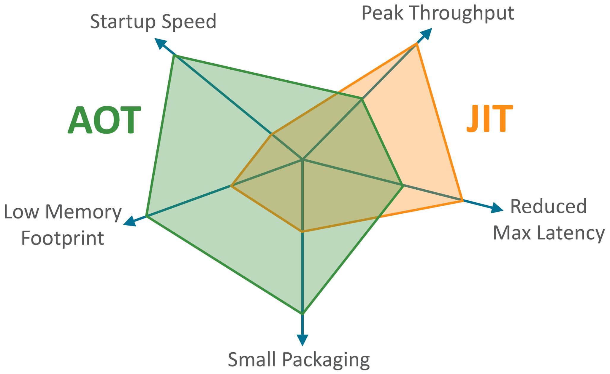

# Preface
<...>
 - This section is excerpted from the following JavaGuide articles:Summary of common interview questions in Java Basics (Part I) (Basic concepts, syntax, data types, variables, methods, etc. of Java language)
 - Summary of common interview questions on Java Fundamentals (middle) (object-oriented basics, comparison and copying of strings, objects, etc.)
 - Summary of common interview questions in Java Fundamentals (Part II) (Exceptional, Generic, Reflection, SPI, Serialization, Annotation, etc.)


# Basic concepts and common sense

## JVM vs JDK vs JRE

### JVM

JVM (Java Virtual Machine) -> Là virtual machine dùng để chạy Java bytecode.  
Implement của JVm trên các hệ diều hành (Windows, Linux, macOS) là khác nhau.  
File `.java` được javac biên dịch (compile) thành file `.class` chứa bytecode. Bytecode này được `JVM` thực thi

```text
.java (source code)
   ↓ javac (compiler)
.class (bytecode – platform independent)
   ↓ JVM
Machine code (native, platform dependent)
```

Có nhiều JVM khác nhau do các tổ chức/cá nhân phát triển tuân theo rule thống nhất để chạy nhưng có thể khác nhau về tối ưu trong GC, JIT, Memory usage, Startup time, Cloud suitability.

### JDK and JRE

JDK (Java Development Kit) => Bộ công cụ phát triển ứng dụng java => Dùng để tạo và compile java.  
JDK bao gồm JRE (Java Runtime Environment), javac và các công cụ khác (javadoc, jdb, jconsole, javap, ...)  
JRE là môi trường runtime để chạy ứng dụng java bao gồm: JVM và các thư viện Java basic khác.  



> **Note:**  
>- Từ java 9, có thể dùng jlink để tạo Java runtime tối giản (đóng gói ứng dụng java cùng JVM + module cần thiết). Không cần thiết phải có đầy đủ JRE  
> - Từ java 11, Oracle không cho phép download JRE riêng lẻ.


### What is bytecode? What are the benefits of adopting bytecode?



### Why is it said that the Java language "compiles and interprets"?

### What are the advantages of AOT? Why not use AOT altogether?

`AOT (Ahead of Time Compilation)` xuất hiện từ JDK 9 -> compile code sang machine code hoàn toàn -> tránh được long warm-up times. Ngoài ra còn có thể giảm memory footprint (bỏ JIT -> bỏ cache của JIT) và tăng bảo mật (khó decompile và chỉnh sửa), phù hợp với cloud-native (khởi động nhanh).




## Basic syntax

### Self-addition and self-subtraction operators

```java
int a = 9;
int b = a++;
int c = ++a;
int d = c--;
int e = --d;
```
