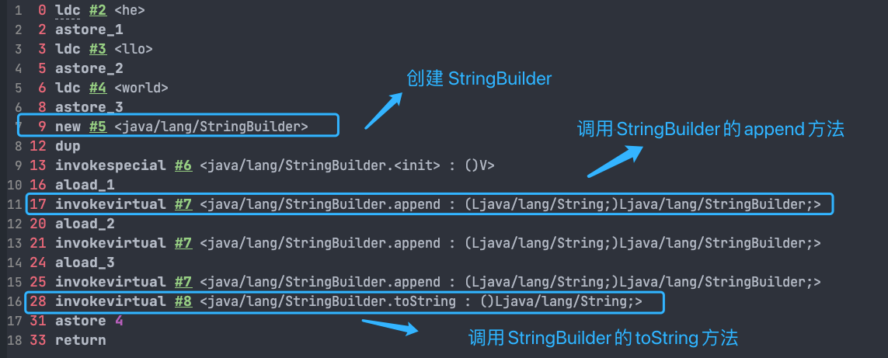
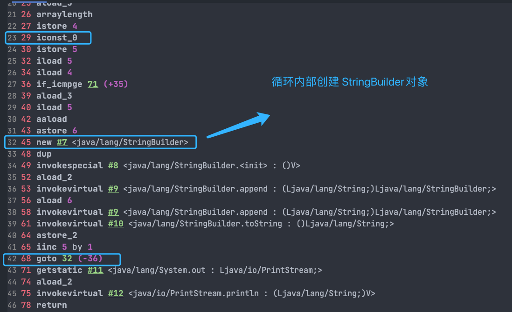

## Object-oriented foundation

### What is the difference between member variables and local variables?

- Member variable:
  - Thuộc về `class`
  - Khai báo trong `class` nhưng ngoài `method`
  - Nếu có `static` thì lưu trong Method Area (metaspace) và dùng chung cho các object
  - Nêu không có `static` thì thuộc về instance và lưu trong heap
  - Tồn tại cùng với object. Nếu là `static` thì tồn tại từ lúc class được load tới khi JVM kết thúc.
- Local variable:
  - Định nghĩa trong code blocks hoặc paramter của method
  - Lưu trong stack, gắn với stack frame của method
  - Tạo khi method được gọi, huỷ khi method kết thúc

### How is the static method different from the instance approach?

Static method vs Instance method  

### What is the difference between overloading and Overriding?

Overloading: -> cùng method name, khác danh sách tham số

```java
class Calculator {

    int add(int a, int b) {
        return a + b;
    }

    double add(double a, double b) {
        return a + b;
    }

    int add(int a, int b, int c) {
        return a + b + c;
    }
}
```

> **Note** Thứ tự ưu tiên trong overloading: Exact match  -> Widening (int -> long) -> Boxing (int -> Integer) -> Varargs

```java
void foo(long x) { }
void foo(Integer x) { }

foo(10); // gọi foo(long) (widening ưu tiên hơn boxing)
```

```java
void foo(Integer x) { }
void foo(int... x) { }

foo(10); // gọi foo(Integer) (boxing ưu tiên hơn Varargs)
```

Overriding -> Class con kế thừa và viết lại class cha

```java
void test(long x) {
    System.out.println("long");
}

void test(int x) {
    System.out.println("int");
}

test(10); // gọi test(int)
```

- Kiểu trả về của method con phải giống hoặc hẹp hơn method cha. Exception range throw phải giống hoặc hẹp hơn method cha. Access modifier phải giống hoặc lớn hơn method cha.
- Không được override method `final`
- Với `static method`, class con có thể khai báo `static method` trùng signature với `static method` của class cha. Nhưng đây là `method hiding` không phải `override`. Method của class con chỉ che method của class cha khi gọi qua class con.

```java
 class A {
    static void hello() {
        System.out.println("A");
    }
}

class B extends A {
    static void hello() {
        System.out.println("B");
    }
}

A a = new B();
B b = new B();

a.hello(); // A -> nếu là override thì phải in ra "B"
b.hello(); // B
```

> -> Không có đa hình, gọi method theo kiểu tham chiếu, không theo object runtime.

### The difference between object-oriented and process-oriented

Compare process-oriented programing (POP) & object-oriented programing (OOP):

- OOP dễ maintain, dễ tái sử dụng, dễ mở rộng
- POP thường là chương trình đơn giản.

### The difference between equality of objects and equality of references

- `==` là so sánh địa chỉ, `equals()` là so sánh giá trị.

### Object-oriented three characteristics

- Encapsulation: Tính đóng gói -> che trạng thái của object bên tỏng object. Không thể truy cập trạng trực tiếp nhưng có thể truy cập bằng các `method` được cung cấp bởi class.
- Inheritance: Tính kế thừa -> Sử dụng định nghĩa của `base class` để tạo class mới.
  - `Subclass` sở hữu tất cả thuộc tính (`properties`) và method của object cha. Nhưng `private property` và `private method` không thể truy cập được.
  - `Subclass` có thể có các `property` và `method` riêng.
  - Subclass có thể triển khai `method` của class cha theo cách riêng.

- Polymorphism: Tính đa hình -> Cùng một lời gọi (method call), nhưng hành vi khác nhau tùy theo object thực tế đang được sử dụng.  
  - Có mối quan hệ kế thừa (class) hoặc triển khai (interface) giữa kiểu của object và kiểu của biến tham chiếu.
  - Phương thức thực sự được gọi bởi biến tham chiếu phải được xác định tại thời điểm chạy (runtime).
  - Đa hình không thể gọi các phương thức chỉ tồn tại ở `subclass` mà không tồn tại ở `superclass`.
  - Nếu `subclass` ghi đè (override) phương thức của superclass thì phương thức của `subclass` sẽ được thực thi; nếu `subclass` không ghi đè thì phương thức của `superclass` sẽ được thực thi.

### Reference Type and Object Type

- Reference type (kiểu tham chiếu) -> quyết định:
  - Gọi được method nào (compile-time)
  - Truy cập được field nào

- Object type (kiểu đối tượng thực) -> Quyết định
  - Method implementation nào được chạy (runtime)

> Compile-time nhìn vào reference type, runtime nhìn vào object type.

### Upcasting và Downcasting

- Upcasting là ép kiểu từ subclass lên superclass -> an toàn

```java
Animal a = new Dog();
```

- Downcasting là ép kiểu từ lớp cha xuống lớp con.
  - Có thể gây lỗi ClassCastException
  - Không an toàn
  - Nên check instanceof trước khi downcasting

```java
if (a instanceof Dog) {
    Dog d = (Dog) a;
    d.fetch();
}
```

```java
if (obj instanceof Dog dog) {
    dog.fetch(); //Pattern matching cho instanceof - Java 16+
}
```

### The difference between interfaces and abstract classes

### Shallow copy and Deep Copy

- Shallow coppy -> chỉ copy giá trị các field. Nếu field là kiểu reference -> copy địa chỉ.
  - Implement interface Cloneable -> override method clone() -> gọi super.clone()

```java
class Person implements Cloneable {
    public Person clone() throws CloneNotSupportedException {
        return (Person) super.clone();
    }
}
```

- Deep copy -> tạo object mới. Mỗi object con đều là instance mới
  - Nên dùng copy constructor thay vì override clone() cho rõ ràng, dễ kiểm soát

```java
class Person {
    Person(Person other) {
        this.name = other.name;
        this.address = new Address(other.address.city);
    }
}
```

## Object

### Common method of object class

|Method   |Override?|  Mục đích chính        |
|---------|---------|------------------------|
|equals   |  ✅     |  So sánh logic         |
|hashCode |✅       |  Hash-based collection |
|toString | ✅      |  Debug / log           |
|clone    | ⚠️      |  Copy object           |
|getClass | ❌      |  Runtime clas          |
|finalize | ❌      |  GC hook (obsolete)    |
|wait     | ❌      |  Thread sync           |
|notify   | ❌      |  Thread sync           |
|notifyAll| ❌      |  Thread sync           |

- Wrapper class mặc định override `equals` method -> so sánh giá trị thay vì địa chỉ.
- hashCode() -> index. 2 đối tượng `a.equals(b) == true` thì `a.hashCode()` phải bằng nhau. Điều ngược lại chưa chắc đúng.
- Override `equals()` method thì phải override cả `hashCode()` method

## String

- Tổng quan nhanh
|Tiêu chí |String |StringBuffer| StringBuilder|
|---|---|--|---|
|Mutable (thay đổi được)?| ❌ Không| ✅ Có| ✅ Có|
|Thread-safe |✅ Có| ✅ Có| ❌ Không|
|Hiệu năng| ❌ Thấp |⏳ Trung bình| 🚀 Cao|
|Ra đời từ |Java 1.0 |Java 1.0 |Java 5|
|Dùng khi| Chuỗi cố định, String đơn giản không loop| Đa luồng| Đơn luồng|

> **Note** Mặc định khi dùng `+` string java sẽ dùng StringBuilder. Nhưng trong vòng for loop thì new object được tạo mới mỗi vòng for.

- ví dụ khi dùng `+` với string

```java
String str1 = "he";
String str2 = "llo";
String str3 = "world";
String str4 = str1 + str2 + str3;
```



- trường hợp dùng `+` với string trong vòng for

```java
String[] arr = {"he", "llo", "world"};
String s = "";
for (int i = 0; i < arr.length; i++) {
    s += arr[i];
}
System.out.println(s);
```



### String.intern

- Là native method.
- Dùng để tương tác với String Pool của JVM
- Nếu chuỗi đã tồn tại trong pool thì trả về reference đã có
- Nếu chuối chưa tồn tại thì thêm vào pool và trả về reference đó  
=>Chuẩn hoá reference, giảm trùng lặp bộ nhớ, tăng tốc độ so sánh chuỗi (==)  

```java
String a = new String("hello");
String b = a.intern();
String c = "hello";

System.out.println(a == c); // false
System.out.println(b == c); // true
```

|**Note**: Java hiện đại có Đeuplication GC (GC features). Đã dedup tự động, không cần intern(), không giữ reference toàn cục nên an toàn hơn intern()

### What happens when variables and constants of type String do "+" operations?

```java
String str1 = "str";
String str2 = "ing";
String str3 = "str" + "ing";
String str4 = str1 + str2;
String str5 = "string";
System.out.println(str3 == str4);//false
System.out.println(str3 == str5);//true
System.out.println(str4 == str5);//false
```

- Nhờ constant folding nên biểu thức chỉ gồm hằng số được tính toán tại thời điểm runtime. Do đó mới có sự giống và khác nhau trong kết quả so sánh trên.

## Unusual

### Overview of the Java Exception Class Hierarchy Diagram

